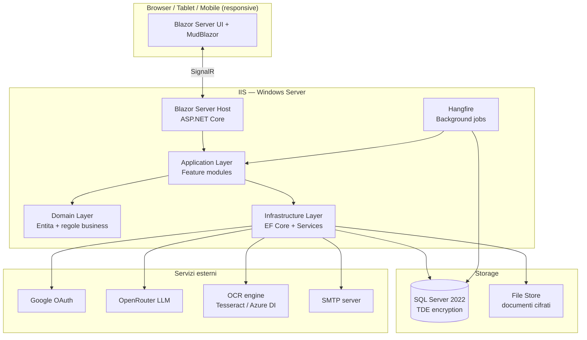
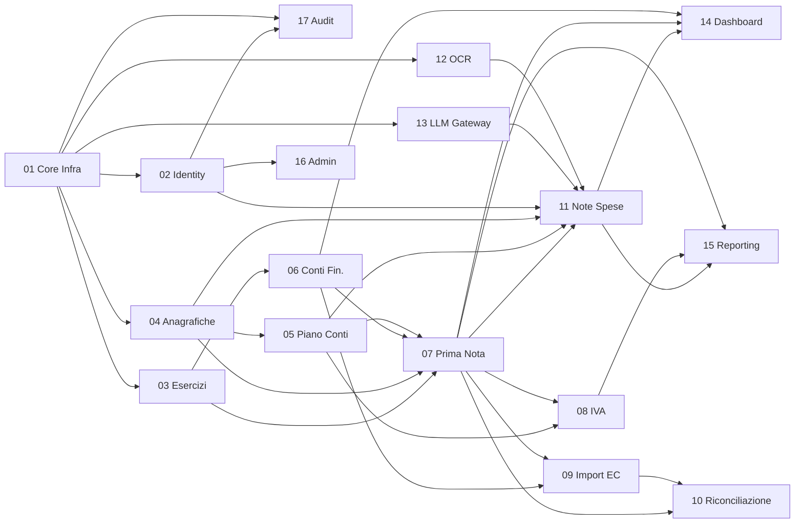

# Project Specification — Prima Nota Aziendale

> **Status:** APPROVATA
> **Versione:** 1.1
> **Data creazione:** 2026-04-16
> **Data approvazione:** 2026-04-16
> **Autore:** Agent (D.O.E. Framework)
> **Approvato da:** Romolo Rubeo

---

## 1. Riepilogo del Progetto

### 1.1 Obiettivo

Software gestionale web per la **prima nota aziendale semplificata** che
automatizza l'importazione di estratti conto bancari, riconcilia i movimenti
con voci di prima nota (via regole + apprendimento dallo storico), gestisce
anagrafiche, causali, IVA periodica, registri IVA, note spese dipendenti
(con OCR di scontrini/fatture) e produce report ed export per il
commercialista, su base di esercizi annuali (01/01 – 31/12).

### 1.2 Utenti / Consumatori Finali

Azienda singola (mono-tenant). Utenti tipici:

| Ruolo | Descrizione | Permessi |
|-------|-------------|----------|
| **Amministratore di sistema** | Gestisce utenti, configurazioni, chiusure anno | Accesso completo + funzioni amministrative |
| **Contabile / Amministrazione** | Operatore principale: inserisce/valida prima nota, riconcilia, stampa registri IVA, export per commercialista | Tutto tranne gestione utenti |
| **Dipendente** | Carica solo le proprie note spese (scontrini, fatture) | Accesso limitato alle proprie note spese e ai relativi documenti |

- Multiutente concorrente (stima: 5–20 utenti attivi, picchi <10 concorrenti).
- Livello tecnico: medio (familiari con gestionali contabili).
- Contesto d'uso: ufficio + mobile/tablet (per dipendenti in mobilita che
  fotografano scontrini).

### 1.3 Vincoli Non Negoziabili

| Vincolo | Categoria | Note |
|---------|-----------|------|
| Stack .NET + Blazor Server + SQL Server | Tecnologia | Preferenza utente esplicita |
| Deploy su IIS (Windows Server) | Tecnologia | Infrastruttura aziendale esistente |
| Conformita GDPR e fiscalita italiana | Normativa | Prima nota semplificata, registri IVA, conservazione documenti |
| Export per commercialista in Excel e PDF | Funzionale | Requisito utente |
| Dati crittografati (at-rest e in-transit) | Sicurezza | Dati contabili sensibili |
| Lingua UI: solo italiano | UX | Requisito utente |
| Solo valuta Euro | Funzionale | Requisito utente |
| Gestione per esercizio annuale solare (01/01–31/12) | Funzionale | Salto automatico al 1° gennaio |
| Attribuzione AI rimossa dai commit (hook D.O.E.) | Policy | Politica di framework |

### 1.4 Integrazioni con Sistemi Esistenti

| Sistema | Tipo Interazione | Protocollo | Autenticazione | Note |
|---------|------------------|------------|----------------|------|
| Google OAuth 2.0 | Read (login) | HTTPS/OIDC | OAuth 2.0 | Alternativa a email/password |
| OpenRouter LLM API | Write/Read | HTTPS/REST | API Key | Suggerimento categorie, post-processing OCR |
| Motore OCR | Interno/Locale | Libreria | — | Tesseract.NET (default locale) o Azure AI Document Intelligence (opzionale) — decisione in Fase 3.5 |
| Estratti conto banca | Read (import) | File upload | — | Formati: CSV, Excel (XLSX), PDF (tabulare) |
| SMTP (opzionale) | Write | SMTP/TLS | user/password | Notifiche (approvazione note spese, alert riconciliazione) |

**Nessuna integrazione in uscita** verso software di contabilita (fuori scope v1, previsto come estensione futura).

### 1.5 Scala Prevista

| Metrica | Valore Iniziale | Valore Target (12 mesi) |
|---------|-----------------|-------------------------|
| Utenti totali | 10 | 25 |
| Utenti concorrenti | 3–5 | 10 |
| Movimenti prima nota / anno | 2.000 | 5.000 |
| Conti finanziari | 10 | 30 |
| Note spese / anno | 500 | 1.500 |
| Documenti allegati (PDF/JPG) | 1 GB | 5 GB |
| Volume DB | 500 MB | 2 GB |

---

## 2. Architettura

### 2.1 Pattern Architetturale

**Pattern scelto:** **Monolite modulare** (Feature-Based Organization).

**Motivazione:**
- Team piccolo, singola azienda cliente, unico deployment.
- Blazor Server e per natura un'applicazione server-side integrata (UI +
  business logic + data access nello stesso processo), non un vero
  Frontend+Backend split con API separata.
- Scale prevista (10 utenti concorrenti, <5k movimenti/anno) ampiamente
  gestibile da un monolite.
- Feature-based organization consente di mantenere i moduli di dominio
  (PrimaNota, Riconciliazione, NoteSpese, IVA…) isolati e testabili,
  lasciando aperta una futura estrazione di un layer API pubblica (per
  integrazioni future con software di contabilita) senza rifattorizzazioni
  traumatiche.
- Principio "in dubio start monolith" dal documento `02-architecture-patterns.md`.

### 2.2 Diagramma Architetturale



### 2.3 Componenti Principali

| Componente | Responsabilita | Tecnologia | Interagisce Con |
|------------|----------------|------------|-----------------|
| UI Layer | Pagine Blazor, componenti, dashboard, upload, wizard | Blazor Server + MudBlazor | Application Layer |
| Application Layer | Servizi applicativi orchestrano use case (comandi, query, validazioni) | .NET 10, MediatR, FluentValidation | Domain + Infrastructure |
| Domain Layer | Entita (Movimento, ContoFinanziario, Causale, Fattura…), value object, regole | .NET 10 pure POCO | — |
| Infrastructure | EF Core repository, servizi esterni (LLM, OCR, OAuth, SMTP), storage file | EF Core 10, HttpClient | Domain + servizi esterni |
| Background Jobs | Elaborazione async di import, OCR, training regole matching | Hangfire su SQL Server | Application + DB |
| Identity & Auth | Registrazione, login email/password, Google OAuth, ruoli/policy | ASP.NET Core Identity | DB |
| Reporting | Generazione Excel e PDF (registri IVA, export commercialista, note spese) | ClosedXML + QuestPDF | Application + DB |
| Import Parser | Parsing estratti conto CSV/Excel/PDF con mapping configurabile | CsvHelper, ClosedXML, PdfPig | Application |
| OCR Service | Estrazione dati da scontrini/fatture | Tesseract.NET (baseline) + post-processing LLM opzionale | Application |
| LLM Gateway | Suggerimento categoria, enhancement OCR, normalizzazione testo | HttpClient su OpenRouter | Application |

---

## 3. Stack Tecnologico

### 3.1 Scelte Tecnologiche

| Categoria | Tecnologia | Versione | Motivazione |
|-----------|------------|----------|-------------|
| Linguaggio | C# | 14 | Ultima, migliorie di sintassi e performance |
| Runtime | .NET | 10 (LTS) | LTS rilasciata 11/2025, supporto fino a 11/2028. Vincolo utente |
| UI Framework | Blazor Server | .NET 10 | Vincolo utente. Modello real-time via SignalR, perfetto per dashboard con saldi live |
| UI Component Library | MudBlazor | 8.x | Maturo, Material Design, responsive (desktop + tablet + mobile), gratuito, grafici integrati |
| Database | SQL Server | 2022 | Vincolo utente. Supporta TDE, JSON, temporal tables, compatibilita IIS |
| ORM | Entity Framework Core | 10 | ORM ufficiale, allineato a .NET 10, supporta migrations, interceptors per audit |
| Validation | FluentValidation | 11.x | Validazione dichiarativa server-side, compatibile con Blazor |
| CQRS/Mediator | MediatR | 12.x | Decoupling handler, favorisce test + estrazione futura di API |
| Background Jobs | Hangfire | 1.8.x | Persistente su SQL Server, dashboard integrata, scheduling ricorrente |
| Authentication | ASP.NET Core Identity | 10 | Built-in, integrazione OAuth/OIDC (Google), ruoli, 2FA opzionale |
| Logging | Serilog | 4.x | Sink su file + SQL Server, structured logging |
| Mapping | Mapster | 7.x | Performance migliore di AutoMapper, sintassi piu semplice |
| Parsing CSV | CsvHelper | 33.x | De-facto standard, configurabile, testato |
| Parsing Excel | ClosedXML | 0.104.x | OSS, non richiede Office installato, robusto |
| Parsing PDF | PdfPig | 0.1.x | OSS (Apache 2.0), parsing testo e tabelle |
| Generazione PDF | QuestPDF | 2024.x | Licenza Community (gratuita < 1M€ ricavi), API fluente, qualita tipografica |
| OCR (baseline) | Tesseract OCR (via Tesseract.NET) | 5.x | OSS, multilingua, offline, nessun costo ricorrente |
| LLM Gateway | OpenRouter via HttpClient nativo | — | Vincolo utente |
| Testing unit | xUnit | 2.9.x | Standard .NET, integrazione CI/CD |
| Testing Blazor | bUnit | 1.34.x | Render test per componenti Blazor |
| Testing E2E | Playwright for .NET | 1.48.x | Cross-browser, screenshot, ottimo per flussi multi-step |
| Mocking | NSubstitute | 5.x | API piu ergonomica di Moq |
| Fixtures | AutoFixture + Bogus | ultime | Dati test realistici in italiano |
| Analyzer/Lint | .NET Roslyn analyzers + StyleCop.Analyzers + SonarAnalyzer.CSharp | ultimi | Qualita e convenzioni |
| Formatter | `dotnet format` | 10 | Built-in |
| CI/CD | GitHub Actions | — | Build, test, publish artefatto per IIS |
| Container (dev) | Docker + SQL Server on Linux container | — | Ambiente di sviluppo uniforme (runtime prod resta IIS/Windows) |
| Package Manager | NuGet + `packages.lock.json` | 10 | Pin deterministico dipendenze (vedi DIR-015) |

### 3.2 Vincoli di Compatibilita

| Dipendenza A | Dipendenza B | Vincolo | Note |
|--------------|--------------|---------|------|
| Blazor Server | IIS WebSocket | IIS deve avere il modulo "WebSocket Protocol" abilitato | Richiesto per SignalR |
| EF Core 10 | SQL Server 2022 | Compatibili; SQL 2019 supportato, SQL 2017 no | Conferma versione prod in fase di deploy |
| Hangfire 1.8 | EF Core | Usa SqlClient proprio, non EF: evita conflitti ma richiede connection string dedicata | Isolare schema `hangfire` nel DB |
| QuestPDF | Licenza | Gratuita fino a ricavi < 1M€/anno | Conforme al profilo utente; monitorare crescita |
| Tesseract.NET | Windows runtime | Richiede `tessdata` con lingua `ita` | Includere nei file di deploy |
| OpenRouter | Latenza | Chiamate sincrone in UI possono bloccare; usare pattern fire-and-forget via Hangfire | Suggerimenti categoria visualizzati asincronamente |

### 3.3 Alternative Considerate e Scartate

| Scelta Fatta | Alternativa Scartata | Motivo |
|--------------|----------------------|--------|
| Blazor Server | Blazor WebAssembly | Vincolo utente; WASM avrebbe richiesto API separata e bundle di grandi dimensioni |
| Blazor Server | Blazor United/Auto (.NET 8+) | Aggiunge complessita di modalita miste non necessaria per progetto interno |
| MudBlazor | Radzen Blazor / Telerik / Syncfusion | MudBlazor e OSS MIT, Radzen free ha meno componenti, Telerik/Syncfusion sono commerciali |
| SQL Server 2022 | PostgreSQL | Vincolo utente (MS SQL Server) |
| Monolite modulare | Frontend + Backend split | Blazor Server e server-integrated: split introdurrebbe solo overhead |
| QuestPDF | iText7 | iText7 ha licenza AGPL (incompatibile con uso interno non open) |
| Tesseract locale | Azure Document Intelligence | Tesseract e a costo zero e offline; Azure resta opzione se l'accuratezza non soddisfa (decisione Fase 3.5 con POC) |
| Hangfire | Quartz.NET | Hangfire ha dashboard integrata, storage SQL Server nativo, API piu semplice |
| Serilog | NLog / built-in ILogger | Serilog ha structured logging piu maturo e sink ricchi |
| Mapster | AutoMapper | Mapster e piu veloce e ha migrato a licenza commerciale (AutoMapper) da metà 2024 |

---

## 4. Scomposizione in Moduli

### 4.1 Mappa dei Moduli

| # | Modulo | Descrizione | Dipende Da | Complessita | Priorita |
|---|--------|-------------|-----------|-------------|----------|
| 01 | **Core Infrastructure** | Soluzione, EF Core, Serilog, health check, configurazione, hosting IIS | — | M | 1 |
| 02 | **Identity & Auth** | ASP.NET Core Identity, login email/password, Google OAuth, ruoli (Admin/Contabile/Dipendente), policy-based authz | 01 | M | 2 |
| 03 | **Esercizi Contabili** | Gestione anno contabile, apertura/chiusura esercizio, switching corrente, filtraggio per anno su tutti i moduli | 01 | S | 3 |
| 04 | **Anagrafiche** | Clienti, fornitori, dipendenti (anagrafica base); collegamento ai movimenti | 01 | M | 4 |
| 05 | **Piano dei Conti & Causali** | Categorie piatte, causali contabili, configurazione default | 01, 04 | M | 5 |
| 06 | **Conti Finanziari** | Cassa, banche, carte di credito/debito; saldi in tempo reale; saldi per anno | 01, 03 | M | 6 |
| 07 | **Prima Nota** | CRUD movimenti, split su piu voci, allegati, stato (bozza/confermato/riconciliato) | 03, 04, 05, 06 | L | 7 |
| 08 | **Gestione IVA** | Aliquote, registri IVA (vendite, acquisti, corrispettivi), calcolo liquidazione periodica (mensile/trimestrale), stampa registri | 05, 07 | L | 8 |
| 09 | **Import Estratti Conto** | Upload CSV/Excel/PDF, parser configurabili per banca, mapping colonne, staging movimenti | 06, 07 | L | 9 |
| 10 | **Motore Riconciliazione** | Matching automatico (importo+data+tolleranza), regole personalizzabili (contiene/regex/IBAN/importo), apprendimento dallo storico, proposte con confidence, split movimento, gestione movimenti pending | 07, 09 | XL | 10 |
| 11 | **Note Spese Dipendenti** | Upload scontrino/foto, OCR, classificazione, pagato con mezzi propri/aziendali, workflow approvazione, generazione rimborso | 02, 04, 05, 07 | L | 11 |
| 12 | **OCR Service** | Tesseract wrapper, pre-processing immagini, estrazione campi, fallback LLM per parsing non strutturato | 01 | M | 12 |
| 13 | **LLM Gateway** | Client OpenRouter, prompt templating, caching suggerimenti, rate limiting | 01 | M | 13 |
| 14 | **Dashboard & Grafici** | Dashboard admin/contabile (entrate/uscite, saldi, top categorie, andamento annuo), dashboard dipendente (note spese YTD) | 06, 07, 11 | M | 14 |
| 15 | **Reporting & Export** | Export Excel/PDF prima nota, registri IVA, liquidazione IVA, pacchetto per commercialista | 07, 08, 11 | M | 15 |
| 16 | **Admin & Configurazione** | Gestione utenti, ruoli, regole riconciliazione, aliquote IVA, impostazioni azienda, logo per stampe | 02 | M | 16 |
| 17 | **Audit & Sicurezza** | Audit trail movimenti, crittografia allegati at-rest, data protection keys, logging operazioni sensibili | 01, 02 | M | trasversale |

### 4.2 Grafo delle Dipendenze



### 4.3 Ordine di Implementazione

1. **Fase 1 — Fondazioni (sprint 1-2):** 01 Core Infra, 02 Identity, 03 Esercizi, 17 Audit (bozza)
2. **Fase 2 — Dominio contabile base (sprint 3-4):** 04 Anagrafiche, 05 Piano Conti & Causali, 06 Conti Finanziari
3. **Fase 3 — Core prima nota (sprint 5-6):** 07 Prima Nota (CRUD, split, allegati)
4. **Fase 4 — IVA (sprint 7):** 08 Gestione IVA
5. **Fase 5 — Automazione estratti conto (sprint 8-10):** 09 Import Estratti Conto, 10 Motore Riconciliazione (MVP matching, poi regole, poi apprendimento storico)
6. **Fase 6 — AI & OCR (sprint 11-12):** 12 OCR, 13 LLM Gateway
7. **Fase 7 — Note spese (sprint 13-14):** 11 Note Spese Dipendenti
8. **Fase 8 — Visualizzazione & report (sprint 15-16):** 14 Dashboard, 15 Reporting & Export
9. **Fase 9 — Admin & hardening (sprint 17):** 16 Admin, completamento 17 Audit, security review, deploy produzione

> Stima indicativa: 17 sprint di 2 settimane ciascuno (≈ 8 mesi con un dev). La pianificazione effettiva viene prodotta dopo l'approvazione (Decision Engine + Task Decomposition).

---

## 5. Dipendenze Esterne

| Pacchetto NuGet | Versione | Scopo | Licenza | Mantenuto | CVE Note |
|-----------------|----------|-------|---------|-----------|----------|
| Microsoft.AspNetCore.App (meta) | 10.0.x | Runtime ASP.NET Core | MIT | Si | Monitorare |
| Microsoft.EntityFrameworkCore.SqlServer | 10.0.x | Provider SQL Server | MIT | Si | Monitorare |
| Microsoft.AspNetCore.Identity.EntityFrameworkCore | 10.0.x | Identity su EF Core | MIT | Si | — |
| Microsoft.AspNetCore.Authentication.Google | 10.0.x | OAuth Google | MIT | Si | — |
| MudBlazor | 8.x | Component library UI | MIT | Si | — |
| MediatR | 12.x | Mediator CQRS | Apache 2.0 | Si | — |
| FluentValidation | 11.x | Validazione | Apache 2.0 | Si | — |
| Hangfire.AspNetCore + Hangfire.SqlServer | 1.8.x | Job in background | LGPL 3.0 (con eccezione linking) | Si | Verificare compliance |
| Serilog.AspNetCore + sinks | 8.x / 4.x | Logging strutturato | Apache 2.0 | Si | — |
| Mapster | 7.x | Object mapping | MIT | Si | — |
| CsvHelper | 33.x | Parsing CSV | MS-PL / Apache 2.0 dual | Si | — |
| ClosedXML | 0.104.x | Excel read/write | MIT | Si | — |
| PdfPig | 0.1.x | Parsing PDF | Apache 2.0 | Si | — |
| QuestPDF | 2024.x | Generazione PDF | Community (gratuita <1M€) | Si | Verificare soglia ricavi |
| Tesseract | 5.x (binding .NET: `Tesseract` NuGet) | OCR locale | Apache 2.0 | Si | Richiede `tessdata` |
| xUnit + xunit.runner.visualstudio | 2.9.x | Test framework | Apache 2.0 | Si | — |
| bUnit | 1.34.x | Test componenti Blazor | MIT | Si | — |
| Microsoft.Playwright | 1.48.x | E2E browser test | Apache 2.0 | Si | — |
| NSubstitute | 5.x | Mocking | BSD 3-Clause | Si | — |
| AutoFixture + Bogus | ultime | Generatori test data | MIT | Si | — |
| StyleCop.Analyzers | 1.2.x | Analyzer stile | Apache 2.0 | Si | — |
| SonarAnalyzer.CSharp | 10.x | Analyzer qualita | LGPL 3.0 | Si | — |

**Dipendenze transitive rilevanti:**
- `System.Text.Json` (via meta-package): tenere aggiornata per CVE
  periodiche su deserializzazione.
- `Microsoft.Data.SqlClient`: driver SQL Server; allineare versione a SQL Server 2022.

---

## 6. Rischi e Mitigazioni

| # | Rischio | Probabilita | Impatto | Mitigazione |
|---|---------|-------------|---------|-------------|
| R1 | Parser PDF estratti conto fragile (layout diversi per banca) | Alta | Alto | **Priorita ai formati CSV/XLSX**: PDF considerato "ultima spiaggia" e supportato solo quando CSV/XLSX non sono disponibili, via template "mapping per banca" + fallback manuale; unit test per ciascun template |
| R2 | Accuratezza OCR su scontrini termici sbiaditi | Alta | Medio | Pre-processing immagine (deskew, threshold), fallback LLM per campi non estratti, campo sempre modificabile dall'utente |
| R3 | Costi LLM (OpenRouter) crescono non controllati | Media | Medio | Rate limiting, caching risultati identici, budget cap configurabile, possibilita di disabilitare LLM globalmente |
| R4 | Riconciliazione automatica errata porta a contabilita scorretta | Media | Alto | Nessun match <95% confidence viene applicato senza conferma; audit trail completo; undo di ogni riconciliazione; dashboard "movimenti pending" |
| R5 | Conformita fiscale italiana (IVA, registri) interpretata male | Media | Alto | Produrre ADR per ogni regola IVA implementata; chiedere validazione al commercialista dell'utente prima di GA; conservare documentazione normativa citata |
| R6 | Performance Blazor Server con tante righe prima nota + SignalR | Media | Medio | Paging server-side, virtualizzazione MudTable, query proiettate, prefetch saldi |
| R7 | Connessione persa (SignalR) causa UX degradata su rete instabile | Media | Basso | Reconnection automatica built-in + toast informativo; stato form preservato lato server |
| R8 | Perdita dati allegati (PDF, immagini) | Bassa | Alto | Storage file con hash SHA-256, backup su infrastruttura utente (responsabilita dichiarata), crittografia at-rest via EFS/BitLocker o colonna VARBINARY cifrata |
| R9 | Migration EF Core errata in produzione | Media | Alto | Migrations script SQL generate + review manuale; backup pre-deploy automatizzato; strategia blue-green su IIS |
| R10 | Licenza Hangfire LGPL o QuestPDF Community ambigua per uso commerciale | Bassa | Medio | ADR dedicato con analisi licenze; Hangfire LGPL con eccezione linking e compatibile con closed-source; QuestPDF gratuito sotto soglia ricavi |
| R11 | Chiusura anno errata (saldo di apertura anno successivo) | Media | Alto | Procedura di chiusura con preview, doppia conferma, log, reversibilita entro 7 giorni |
| R12 | Gestione multiutente concorrente su stesso movimento | Media | Medio | Concurrency token EF Core (rowversion), lock ottimistico con messaggio "un altro utente ha modificato..." |

---

## 7. Struttura Directory

```
prima-nota/
├── src/
│   ├── PrimaNota.Web/                    # Blazor Server host, IIS entry point
│   │   ├── Components/                   # Layout, shared components
│   │   ├── Pages/                        # Pagine Blazor per feature
│   │   ├── wwwroot/
│   │   ├── appsettings.json
│   │   ├── appsettings.Staging.json
│   │   ├── appsettings.Production.json
│   │   ├── Program.cs
│   │   └── PrimaNota.Web.csproj
│   ├── PrimaNota.Features/               # Feature-based (uno per modulo)
│   │   ├── Anagrafiche/
│   │   ├── ContiFinanziari/
│   │   ├── Esercizi/
│   │   ├── Iva/
│   │   ├── NoteSpese/
│   │   ├── PianoConti/
│   │   ├── PrimaNota/
│   │   ├── Reporting/
│   │   └── Riconciliazione/
│   ├── PrimaNota.Domain/                 # Entita, value object, domain services
│   ├── PrimaNota.Infrastructure/         # EF Core, repositories, migrations, servizi esterni
│   │   ├── Persistence/
│   │   ├── Identity/
│   │   ├── Integrations/
│   │   │   ├── Google/
│   │   │   ├── OpenRouter/
│   │   │   ├── Ocr/
│   │   │   └── Smtp/
│   │   ├── Storage/                      # file store cifrato
│   │   └── BackgroundJobs/               # Hangfire jobs
│   ├── PrimaNota.Application/            # Handler MediatR, DTO, validators
│   └── PrimaNota.Shared/                 # Constants, resource strings (IT), enum
├── tests/
│   ├── PrimaNota.UnitTests/
│   ├── PrimaNota.IntegrationTests/       # Testcontainers per SQL Server
│   ├── PrimaNota.ComponentTests/         # bUnit per componenti Blazor
│   └── PrimaNota.E2ETests/               # Playwright
├── docs/
│   ├── project-spec.md                   # Questo documento
│   ├── tech-specs.md                     # Registro dipendenze
│   ├── architecture.md                   # Dettaglio architetturale
│   ├── deployment.md                     # Guida deploy IIS
│   ├── changelog.md
│   ├── user-manual.md                    # Manuale utente (IT)
│   ├── fiscal-rules.md                   # Regole fiscali/IVA implementate
│   └── adr/                              # Architecture Decision Records
├── .github/
│   └── workflows/
│       ├── ci.yml                        # build + test + analyzer
│       ├── security-scan.yml             # dotnet list package --vulnerable + CodeQL
│       └── deploy.yml                    # publish artefatto IIS (staging auto, prod manual)
├── doe-framework/                        # Framework D.O.E. (presente)
├── scripts/
│   ├── setup-dev.ps1                     # setup ambiente dev (DB, secrets, tessdata)
│   ├── seed-data.ps1                     # dati demo (causali, aliquote IVA italiane)
│   └── backup-db.ps1
├── deploy/
│   ├── iis/
│   │   ├── web.config
│   │   └── app-pool-setup.ps1
│   └── sql/
│       └── init.sql
├── tessdata/                             # dati lingua OCR (ita)
├── .editorconfig
├── .gitignore
├── global.json                           # pin SDK .NET 10
├── Directory.Packages.props              # Central Package Management
├── Directory.Build.props                 # warnings as errors, nullable, analyzers
├── PrimaNota.sln
├── CLAUDE.md                             # (già presente — gitignored)
├── README.md
└── CHANGELOG.md
```

---

## 8. Piano di Testing

| Livello | Scope | Tool | Copertura Target | Note |
|---------|-------|------|------------------|------|
| Unit | Domain, Application handlers, parser CSV/XLSX, motore riconciliazione, calcolo IVA | xUnit + NSubstitute + AutoFixture | ≥ 80% su Domain e Application; ≥ 90% su calcolo IVA e riconciliazione | TDD fortemente raccomandato su moduli 08, 10 |
| Component | Componenti Blazor critici (tabella prima nota, form movimento, dashboard) | bUnit | Flussi principali | Render + interazione |
| Integration | EF Core repository, migrations, Hangfire, Identity | xUnit + Testcontainers (SQL Server Linux) | Ogni repository e query complessa | DB reale in container; stessa versione di produzione |
| E2E | Login, CRUD movimento, import estratto conto completo con riconciliazione, note spesa con OCR, export registro IVA | Playwright for .NET | 10-15 flussi business critical | Eseguiti su staging ad ogni release |
| Smoke | Health endpoint + login + creazione movimento dummy post-deploy | PowerShell script | Tutti gli ambienti | Eseguito da GitHub Actions post-deploy |
| Security | Scansione dipendenze, CodeQL, verifica header sicurezza | `dotnet list package --vulnerable`, CodeQL, OWASP ZAP baseline | Ogni PR + settimanale | Blocca PR su CVE High/Critical |
| Performance | Query DB su dataset 10k movimenti, rendering tabella paginata | BenchmarkDotNet + k6 (su staging) | Query < 500ms, prima pagina < 1s | Su richiesta prima di GA |

---

## 9. Piano di Deploy

### 9.1 Ambienti

| Ambiente | Piattaforma | URL | Strategia Deploy |
|----------|-------------|-----|------------------|
| Development | Windows/macOS/Linux + Docker (SQL Server container) | https://localhost:5001 | `dotnet run` con hot reload |
| Staging | IIS su Windows Server (aziendale) | https://primanota-staging.[dominio-azienda] | GitHub Actions — deploy automatico su merge in `develop` |
| Production | IIS su Windows Server (aziendale) | https://primanota.[dominio-azienda] | GitHub Actions — deploy su merge in `main` con approvazione manuale |

### 9.2 Requisiti Infrastrutturali

**Server applicativo (staging e production):**
- Windows Server 2022 o piu recente
- IIS 10+ con moduli: ASP.NET Core Hosting Bundle (.NET 10), WebSocket Protocol, URL Rewrite
- 4 vCPU, 8 GB RAM (staging: 2 vCPU, 4 GB)
- 50 GB storage per app + allegati (piu spazio per allegati in cartella separata)
- Certificato TLS valido (HTTPS obbligatorio)

**Database server:**
- SQL Server 2022 Standard (o 2019 minimo)
- TDE (Transparent Data Encryption) abilitata
- Backup pianificati (full giornaliero + log ogni 15 min) — responsabilita infrastruttura utente
- Collation: `Latin1_General_CI_AS` o `SQL_Latin1_General_CP1_CI_AS`

**Storage allegati:**
- Cartella dedicata con ACL ristrette al service account IIS
- Crittografia filesystem (EFS/BitLocker) O colonna VARBINARY cifrata in DB (decisione in Fase 3.5)

### 9.3 Segreti e Configurazione

| Segreto | Dove Configurarlo | Descrizione |
|---------|-------------------|-------------|
| `ConnectionStrings__AppDb` | Environment variable su IIS + `dotnet user-secrets` in dev | Connection string SQL Server |
| `ConnectionStrings__Hangfire` | Environment variable | Schema separato per Hangfire |
| `Authentication__Google__ClientId` | Environment variable | OAuth Google client ID |
| `Authentication__Google__ClientSecret` | Environment variable (IIS) | OAuth Google client secret |
| `OpenRouter__ApiKey` | Environment variable | Chiave API OpenRouter |
| `OpenRouter__BudgetMonthlyEuro` | Environment variable | Budget mensile LLM |
| `DataProtection__KeyRingPath` | Environment variable | Percorso persistenza chiavi ASP.NET Data Protection |
| `DataProtection__CertificateThumbprint` | Environment variable | Certificato per cifrare keyring |
| `Smtp__Host`, `Smtp__Port`, `Smtp__User`, `Smtp__Password` | Environment variable | Notifiche email |
| `AttachmentsEncryption__Key` | Environment variable (Key Vault o DPAPI) | Chiave AES per allegati se cifratura a colonna |
| `AdminBootstrap__Email`, `AdminBootstrap__Password` | Environment variable (solo first-run) | Admin iniziale; cancellare dopo setup |

**Note operative:**
- Mai versionare segreti. `.env` non e usato su IIS: preferire *Environment Variables* gestite dal pool applicativo o Azure Key Vault / Windows DPAPI.
- `appsettings.Production.json` contiene SOLO configurazioni non sensibili.
- Migrations EF Core: modalita "generate SQL script" + esecuzione manuale con review in produzione (mai `dotnet ef database update` in prod).

---

## 10. Stima di Complessita

| Parametro | Valore |
|-----------|--------|
| Size complessiva | **L / XL** |
| Numero moduli | 17 |
| Dipendenze esterne dirette | ~22 pacchetti NuGet chiave |
| Integrazioni | 5 (Google OAuth, OpenRouter, OCR, SMTP, IIS) |
| Complessita stimata | **Alta** (dominio contabile italiano + riconciliazione intelligente + OCR + IVA) |

---

## Punti Aperti / Decisioni in Sospeso

Tutti i punti sono stati decisi in fase di approvazione. Restano ADR dedicati per formalizzare le scelte durante lo sviluppo.

| # | Decisione | Esito | Note |
|---|-----------|-------|------|
| P1 | **OCR engine definitivo** | **Tesseract locale** (baseline) | POC nel modulo 12 per misurare accuratezza; se < 80% F1 su scontrini reali si valutera upgrade (non blocca MVP) |
| P2 | **Cifratura allegati** | **Filesystem** (EFS/BitLocker) | ACL ristrette al service account IIS + crittografia volume; semplifica backup |
| P3 | **Modus operandi riconciliazione tardiva** | **Workflow a stati** (vedi sezione sotto) | Approvato dall'utente |
| P4 | **Regime IVA supportato** | **Ordinario mensile + trimestrale + forfettario** | Forfettario aggiunto su richiesta utente (niente liquidazione IVA su imponibile forfettario; flag a livello aziendale con possibilita di switch annuale) |
| P5 | **Conservazione documenti** | **10 anni** (conformita normativa IT) | Nessun archivio a freddo automatico in v1; documentazione procedura manuale |
| P6 | **Workflow approvazione note spese** | **Approvazione contabile obbligatoria** | Stati: `DRAFT → SUBMITTED → APPROVED / REJECTED → REIMBURSED`; dipendente puo rieditare DRAFT/REJECTED, contabile approva/rifiuta SUBMITTED |

### Proposta di Workflow per Riconciliazione Tardiva (P3)

Ogni record ha uno stato:

```
MovimentoBancario:
  - IMPORTED          (appena importato, non ancora esaminato)
  - AUTO_MATCHED      (match automatico sopra soglia, in attesa conferma)
  - MATCHED           (confermato, collegato a uno o piu movimenti prima nota)
  - PENDING           (esaminato, nessun match trovato, da riconciliare)
  - IGNORED           (escluso manualmente, es. giroconto interno gia registrato)

MovimentoPrimaNota:
  - DRAFT             (bozza)
  - CONFIRMED         (confermato, non ancora collegato a movimento bancario)
  - RECONCILED        (collegato a uno o piu movimenti bancari)
```

**Regole operative:**
1. Import estratto conto → crea movimenti in `IMPORTED`.
2. Motore matching gira in background e propone match: se confidence ≥ 95% → `AUTO_MATCHED` (un click conferma); altrimenti mostra candidati ordinati per confidence.
3. Movimenti senza match → `PENDING`, visibili in dashboard "Da riconciliare".
4. Dall'inserimento di una nuova prima nota, se esiste un movimento bancario `PENDING` con importo+data compatibili, il sistema propone il match inverso.
5. Tolleranza temporale configurabile per banca (default ±3 giorni per importi bonifico, stesso giorno per POS).
6. Split: un movimento bancario puo essere collegato a N movimenti di prima nota (es. bonifico stipendi cumulativo split su N dipendenti); la somma deve quadrare.
7. Regole personalizzate (es. "se descrizione contiene ENEL e importo < 500 → categoria Utenze Luce, fornitore Enel SpA"): vengono applicate in pre-processing e contribuiscono alla confidence.
8. Apprendimento storico: ogni conferma manuale aggiorna i pesi delle feature (keyword, importo range, fornitore) per proposte future — implementazione iniziale con scoring deterministico (Naive Bayes leggero); upgrade a LLM opzionale.
9. Ogni riconciliazione e reversibile con un click entro un periodo configurabile (default 30 giorni) e produce entry in audit log.

---

## Storico Modifiche

| Data | Versione | Modifica | Motivazione |
|------|----------|----------|-------------|
| 2026-04-16 | 1.0 | Creazione iniziale | Generata da Project Intake Protocol (DIR-001) dopo raccolta requisiti Fase 1 + Fase 2 |
| 2026-04-16 | 1.1 | Approvata. Punti aperti risolti: P1 Tesseract, P2 filesystem, P4 aggiunto forfettario, P5 10 anni, P6 workflow approvativo inserito. Rischio R1 chiarito (PDF come ultima spiaggia). | Approvazione esplicita dell'utente |

---

*Documento generato dal framework D.O.E. — [DOE.md](../doe-framework/DOE.md)*
