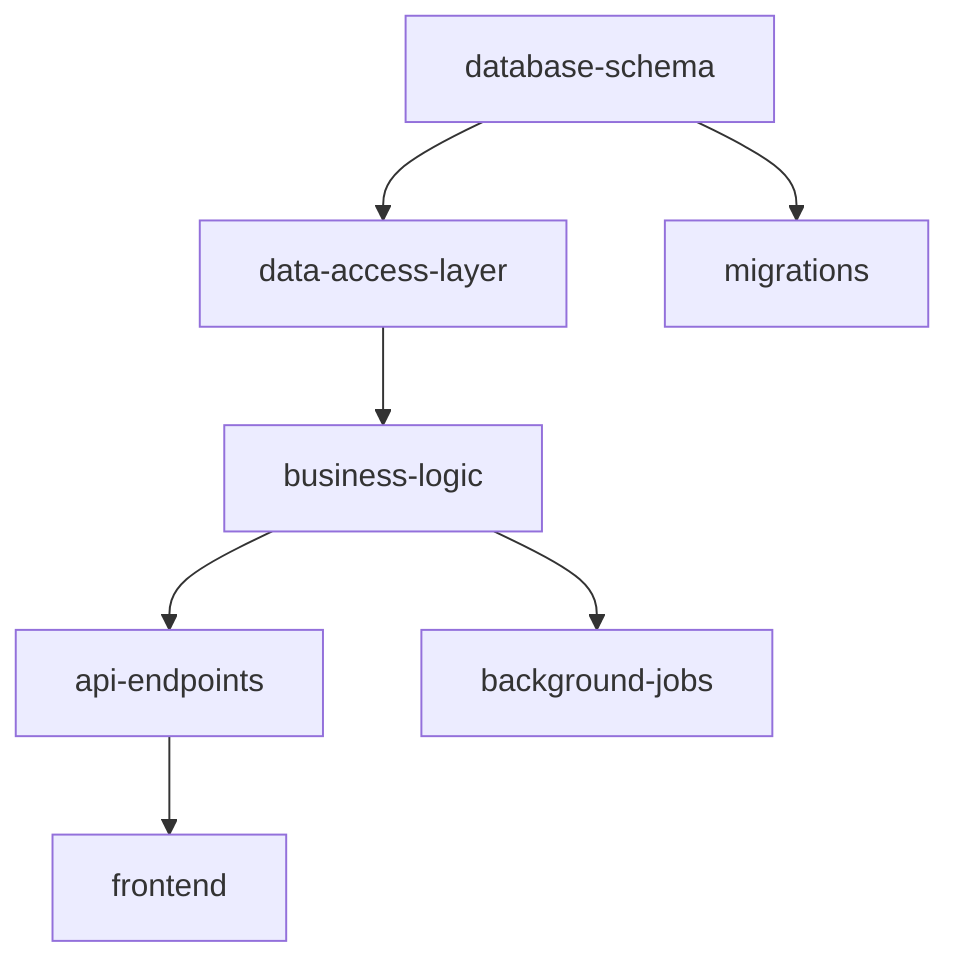

# Task Decomposition — Come Scomporre un Progetto in Task

> **Versione:** 1.0.0
> **Ultimo aggiornamento:** 2026-03-24
> **Livello:** L2 — Orchestrazione
> **Dipende da:** [DOE.md](../DOE.md), [01-decision-engine.md](01-decision-engine.md), [04-interaction-protocol.md](04-interaction-protocol.md)

---

## Scopo

Questo documento definisce **come l'agent scompone un progetto complesso in task
atomici eseguibili**. La decomposizione è il ponte tra la specifica tecnica approvata
(output del Project Intake) e l'esecuzione concreta. Una decomposizione corretta
garantisce che il lavoro proceda in ordine logico, che le dipendenze siano rispettate
e che l'utente possa monitorare l'avanzamento.

---

## Quando Attivare la Task Decomposition

Il Decision Engine (01-decision-engine.md) attiva questo protocollo quando il task
è classificato come **composto**. Un task è composto quando soddisfa almeno una di
queste condizioni:

- Coinvolge più di un modulo o componente
- Richiede la creazione di più di 3 file
- Ha dipendenze interne (un pezzo di codice dipende da un altro)
- Richiede più di una fase logica (es. setup → implementazione → test → deploy)
- La stima di effort supera la complessità "S" (Small)

---

## Processo di Decomposizione

### Fase 1 — Identificazione dei Moduli

Partendo dalla specifica tecnica approvata, l'agent identifica i **moduli** del progetto.
Un modulo è un componente logicamente separabile che:

- Ha una responsabilità chiara e definita
- Ha interfacce (input/output) ben definite verso gli altri moduli
- Può essere sviluppato e testato in modo relativamente indipendente

Per ogni modulo, l'agent documenta:

| Campo | Descrizione |
|-------|-------------|
| Nome | Identificativo univoco del modulo (es. `auth`, `api-gateway`, `user-service`) |
| Responsabilità | Cosa fa questo modulo in una frase |
| Interfacce | Input che riceve e output che produce |
| Dipendenze | Da quali altri moduli dipende |
| Complessità stimata | S / M / L / XL |

### Fase 2 — Mappatura delle Dipendenze (DAG)

L'agent costruisce un **grafo diretto aciclico (DAG)** delle dipendenze tra moduli.
Il grafo determina l'ordine di implementazione.

Regole per la costruzione del DAG:

1. Un modulo A dipende da B se A non può essere implementato o testato senza
   che B esista (almeno come interfaccia/stub)
2. Le dipendenze circolari indicano un difetto di design — se rilevate, l'agent
   si ferma e propone un refactoring (Interaction Protocol S8)
3. Le dipendenze verso servizi esterni (API, database) non contano come
   dipendenze tra moduli — vengono gestite con mock nei test

Rappresentazione del DAG in formato testuale (Mermaid):



### Fase 3 — Definizione dell'Ordine di Implementazione

L'agent determina l'ordine di implementazione seguendo il principio **bottom-up**:
partire dai moduli senza dipendenze (foglie del DAG) e risalire verso i moduli
che dipendono da essi.

Criteri aggiuntivi per l'ordinamento (a parità di livello nel DAG):

1. **Infrastruttura prima della logica** — Database schema e configurazioni
   prima del codice applicativo
2. **Core prima delle feature** — Il nucleo dell'applicazione prima delle
   funzionalità aggiuntive
3. **Backend prima del frontend** — Le API prima dell'interfaccia (quando
   sono nello stesso progetto)
4. **Rischio alto prima** — I componenti con più incertezza prima, per
   scoprire problemi il prima possibile

### Fase 4 — Scomposizione in Task Atomici

Ogni modulo viene scomposto in **task atomici**. Un task atomico è un'unità di lavoro
che può essere completata in un singolo passo logico e verificata immediatamente.

Per ogni task, l'agent definisce:

```markdown
### TASK-[NNN]: [Nome descrittivo]

**Modulo:** [Nome del modulo di appartenenza]
**Dipende da:** [Lista di TASK-ID prerequisiti, o "nessuno"]
**Complessità:** S | M | L | XL

**Descrizione:**
[Cosa deve essere fatto — specifico e non ambiguo]

**Input:**
- [File, dati, configurazioni necessarie]

**Output:**
- [File creati o modificati]
- [Artefatti prodotti]

**Acceptance Criteria:**
- [ ] [Criterio verificabile 1]
- [ ] [Criterio verificabile 2]
- [ ] [Criterio verificabile N]

**Test di Verifica:**
- [ ] [Test specifico che valida il completamento]

**Note:**
[Vincoli, attenzioni particolari, riferimenti a direttive]
```

### Fase 5 — Definizione dei Checkpoint

L'agent inserisce **checkpoint di validazione** nel piano dei task. Un checkpoint
è un punto in cui l'agent si ferma e sincronizza con l'utente
(vedi Interaction Protocol, livello Checkpoint).

Regole per il posizionamento dei checkpoint:

| Regola | Quando inserire un checkpoint |
|--------|-------------------------------|
| Frequenza base | Ogni `checkpoint_interval` task completati (default: 5) |
| Fine modulo | Dopo il completamento di ogni modulo |
| Cambio di fase | Al passaggio tra fasi logiche (es. da setup a implementazione) |
| Dopo rischio | Dopo un task ad alto rischio o con alta incertezza |
| Pre-integrazione | Prima di integrare moduli tra loro |
| Pre-deploy | Prima di qualsiasi operazione di deploy |

---

## Stima della Complessità

L'agent stima la complessità di ogni task usando una scala relativa:

| Livello | Indicazione | Esempi tipici |
|---------|-------------|---------------|
| **S** (Small) | Un singolo file, logica lineare, nessuna dipendenza esterna | Aggiungere un campo a un modello, creare un helper, scrivere un test unitario |
| **M** (Medium) | 2-4 file, logica con condizioni, possibili dipendenze | Implementare un endpoint CRUD, creare un componente con stato, configurare un servizio |
| **L** (Large) | 5-10 file, logica complessa, multiple dipendenze | Implementare un flusso di autenticazione, creare un sistema di permessi, integrare un servizio esterno |
| **XL** (Extra Large) | 10+ file, logica molto complessa, impatto architetturale | Refactoring di un modulo core, migrazione di database, implementazione di un sistema distribuito |

Le stime sono indicative e servono per pianificare i checkpoint e comunicare
l'effort previsto all'utente. Non sono impegni contrattuali.

---

## Gestione delle Modifiche al Piano

Il piano dei task non è immutabile. L'agent lo aggiorna quando:

1. **Un task rivela nuove dipendenze** — Aggiungi i task necessari, riordina
2. **L'utente cambia requisiti** — Vedi sotto-albero "Richiesta di Modifica" nel Decision Engine
3. **Un errore architetturale emerge** — STOP, proponi refactoring (vedi Error Recovery)
4. **La stima era errata** — Aggiorna la complessità, inserisci checkpoint aggiuntivo se necessario

Ad ogni modifica del piano, l'agent:
- Aggiorna il `project-state.md` con il nuovo piano
- Informa l'utente della modifica e della motivazione nel prossimo report/checkpoint
- Ricalcola l'ordine di esecuzione in base alle nuove dipendenze

---

## Esempio di Decomposizione

Per un progetto "API REST per gestione utenti con autenticazione JWT":

```
Moduli identificati:
  1. database-schema (S) — Nessuna dipendenza
  2. user-model (S) — Dipende da: database-schema
  3. auth-service (M) — Dipende da: user-model
  4. api-endpoints (M) — Dipende da: auth-service, user-model
  5. middleware (S) — Dipende da: auth-service
  6. api-docs (S) — Dipende da: api-endpoints

Ordine di implementazione:
  database-schema → user-model → auth-service → middleware → api-endpoints → api-docs

Task atomici (estratto):
  TASK-001: Setup progetto e dipendenze base               [S] → Checkpoint
  TASK-002: Definire schema database utenti                 [S]
  TASK-003: Implementare modello User con validazione       [S]
  TASK-004: Scrivere unit test per modello User             [S]
  TASK-005: Implementare servizio di registrazione          [M] → Checkpoint
  TASK-006: Implementare servizio di login con JWT          [M]
  TASK-007: Implementare middleware di autenticazione        [S]
  TASK-008: Scrivere test per auth-service                  [M]
  TASK-009: Implementare endpoint CRUD utenti               [M] → Checkpoint
  TASK-010: Implementare rate limiting                      [S]
  TASK-011: Scrivere integration test per API               [M]
  TASK-012: Generare documentazione API (OpenAPI)           [S]
  TASK-013: Scrivere test E2E                               [M] → Checkpoint finale
```

---

## Regole Operative

1. **Ogni task deve essere completabile e verificabile indipendentemente.**
   Se un task non può essere testato senza completare il successivo, i due task
   sono in realtà uno solo — accorpali.

2. **Non creare task troppo granulari.** "Scrivere la riga 42 del file X" non è
   un task utile. Il livello giusto è: "Implementare la funzione di validazione email
   nel modulo user-model".

3. **Non creare task troppo grossi.** Se un task ha complessità XL, probabilmente
   può essere scomposto ulteriormente. L'obiettivo è che ogni task sia completabile
   in una sessione di lavoro focalizzata.

4. **I test sono task espliciti, non attività implicite.** "Scrivere unit test per X"
   è un task separato, non un sotto-punto di "Implementare X". Questo garantisce
   che il testing non venga mai saltato.

5. **Il primo task è sempre il setup.** Inizializzazione del progetto, installazione
   dipendenze, configurazione dell'ambiente. Solo dopo il setup si implementa.
