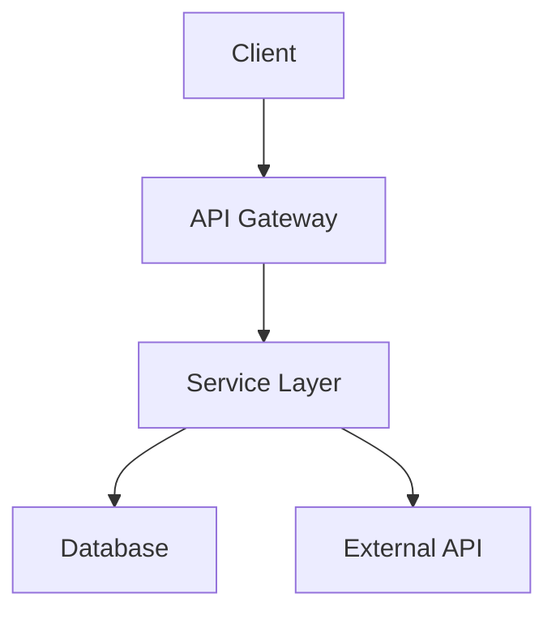
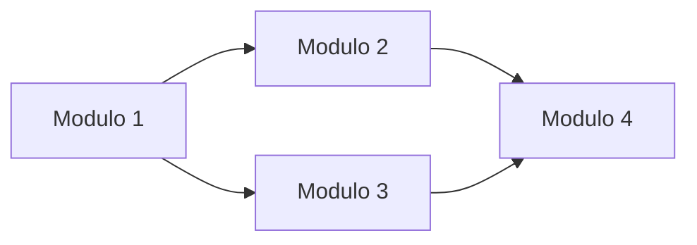

# Project Specification — [NOME PROGETTO]

> **Status:** BOZZA | IN REVISIONE | APPROVATA
> **Versione:** 1.0
> **Data creazione:** YYYY-MM-DD
> **Data approvazione:** —
> **Autore:** Agent (D.O.E. Framework)
> **Approvato da:** [Nome utente]

---

## 1. Riepilogo del Progetto

### 1.1 Obiettivo

[Una frase chiara che descrive cosa fa il progetto e perche esiste.]

### 1.2 Utenti / Consumatori Finali

[Chi usera il sistema. Includere: tipo di utente, numero previsto,
livello tecnico, contesto d'uso.]

### 1.3 Vincoli Non Negoziabili

[Elenco dei vincoli che non possono essere modificati. Ogni vincolo
deve indicare la categoria: budget, timeline, tecnologia, normativa, altro.]

| Vincolo | Categoria | Note |
|---------|-----------|------|
| [Vincolo 1] | [Categoria] | [Dettagli] |

### 1.4 Integrazioni con Sistemi Esistenti

[Sistemi esterni con cui il progetto deve comunicare. Per ciascuno
indicare: nome, tipo di interazione, protocollo, autenticazione.]

| Sistema | Tipo Interazione | Protocollo | Autenticazione | Documentazione |
|---------|-----------------|------------|----------------|----------------|
| [Sistema 1] | [Read/Write/Both] | [REST/gRPC/SDK/...] | [API Key/OAuth/...] | [Link docs] |

### 1.5 Scala Prevista

| Metrica | Valore Iniziale | Valore Target (6-12 mesi) |
|---------|-----------------|---------------------------|
| Utenti concorrenti | [N] | [N] |
| Volume dati | [N MB/GB] | [N MB/GB] |
| Throughput | [N req/s o operazioni/ora] | [N req/s] |
| Storage | [N MB/GB] | [N MB/GB] |

---

## 2. Architettura

### 2.1 Pattern Architetturale

[Nome del pattern scelto: Monolite, Monorepo Multi-servizio, Microservizi, ecc.]

**Motivazione:**
[Perche questo pattern e stato scelto rispetto alle alternative.
Citare i criteri di selezione da `02-architecture-patterns.md`.]

### 2.2 Diagramma Architetturale



### 2.3 Componenti Principali

[Per ogni componente indicare: nome, responsabilita, tecnologia, interazioni.]

| Componente | Responsabilita | Tecnologia | Interagisce Con |
|------------|---------------|------------|-----------------|
| [Componente 1] | [Cosa fa] | [Stack] | [Lista componenti] |

---

## 3. Stack Tecnologico

### 3.1 Scelte Tecnologiche

| Categoria | Tecnologia | Versione | Motivazione |
|-----------|-----------|----------|-------------|
| Linguaggio | [es. Python] | [es. 3.12] | [Perche questa scelta] |
| Framework | [es. FastAPI] | [es. 0.115.x] | [Perche questa scelta] |
| Database | [es. PostgreSQL] | [es. 16] | [Perche questa scelta] |
| ORM/Query Builder | [es. SQLAlchemy] | [es. 2.0.x] | [Perche questa scelta] |
| Testing | [es. pytest] | [es. 8.x] | [Perche questa scelta] |
| Linter/Formatter | [es. ruff] | [es. 0.5.x] | [Perche questa scelta] |

### 3.2 Vincoli di Compatibilita

[Vincoli noti tra le dipendenze. Questo diventa la base per `docs/tech-specs.md`.]

| Dipendenza A | Dipendenza B | Vincolo | Note |
|-------------|-------------|---------|------|
| [Pacchetto] | [Pacchetto] | [Descrizione vincolo] | [Dettagli] |

### 3.3 Alternative Considerate e Scartate

[Per le scelte non ovvie, documentare cosa e stato scartato e perche.]

| Scelta Fatta | Alternativa Scartata | Motivo |
|-------------|---------------------|--------|
| [Tecnologia scelta] | [Alternativa] | [Perche scartata] |

---

## 4. Scomposizione in Moduli

### 4.1 Mappa dei Moduli

[Elenco dei moduli con le loro dipendenze, ordinati per priorita di implementazione.]

| # | Modulo | Descrizione | Dipende Da | Complessita | Priorita |
|---|--------|-------------|-----------|-------------|----------|
| 1 | [Modulo] | [Descrizione] | [Nessuna / Lista moduli] | [S/M/L/XL] | [1-N] |

### 4.2 Grafo delle Dipendenze



### 4.3 Ordine di Implementazione

[Lista ordinata dei moduli nell'ordine in cui verranno implementati,
basato sul grafo delle dipendenze (bottom-up).]

1. **Fase 1:** [Moduli senza dipendenze]
2. **Fase 2:** [Moduli che dipendono solo dalla Fase 1]
3. **Fase N:** [...]

---

## 5. Dipendenze Esterne

| Pacchetto | Versione | Scopo | Licenza | Mantenuto | CVE Note |
|-----------|----------|-------|---------|-----------|----------|
| [Nome] | [X.Y.Z] | [A cosa serve] | [MIT/Apache/...] | [Si/No — ultimo commit] | [Si/No] |

**Dipendenze transitive rilevanti:**
[Segnalare dipendenze transitive che portano rischi o vincoli.]

---

## 6. Rischi e Mitigazioni

| # | Rischio | Probabilita | Impatto | Mitigazione |
|---|---------|-------------|---------|-------------|
| 1 | [Descrizione rischio] | [Bassa/Media/Alta] | [Basso/Medio/Alto] | [Azione di mitigazione] |

---

## 7. Struttura Directory

```
project-root/
├── src/                    # Codice sorgente
│   └── [struttura specifica dello stack]
├── tests/                  # Test suite
│   ├── unit/
│   ├── integration/
│   └── e2e/
├── docs/                   # Documentazione
│   ├── architecture.md
│   ├── api.md
│   ├── deployment.md
│   └── tech-specs.md
├── directives/             # SOP D.O.E. (Livello 1)
├── execution/              # Script deterministici D.O.E. (Livello 3)
├── .tmp/                   # File temporanei (gitignored)
├── .env                    # Variabili d'ambiente (gitignored)
├── .env.example            # Template variabili d'ambiente
├── .gitignore
├── README.md
├── CHANGELOG.md
└── [file specifici dello stack: package.json, pyproject.toml, ecc.]
```

---

## 8. Piano di Testing

| Livello | Scope | Tool | Copertura Target | Note |
|---------|-------|------|-----------------|------|
| Unit | [Quali moduli/funzioni] | [pytest/jest/...] | [80%+] | [Note] |
| Integration | [Quali interazioni] | [Tool] | [Criteri] | [Note] |
| E2E | [Quali flussi utente] | [Playwright/Cypress/...] | [Flussi critici] | [Note] |
| Smoke | [Healthcheck post-deploy] | [curl/script custom] | [Tutti gli ambienti] | [Note] |

---

## 9. Piano di Deploy

### 9.1 Ambienti

| Ambiente | Piattaforma | URL | Strategia Deploy |
|----------|------------|-----|------------------|
| Development | [Locale / Docker] | localhost:XXXX | Manuale |
| Staging | [Provider] | [URL] | [CI/CD automatico] |
| Production | [Provider] | [URL] | [CI/CD con approvazione] |

### 9.2 Requisiti Infrastrutturali

[Risorse necessarie per ogni ambiente: CPU, RAM, storage, servizi managed.]

### 9.3 Segreti e Configurazione

[Lista dei segreti necessari — SENZA i valori, solo i nomi e dove configurarli.]

| Segreto | Dove Configurarlo | Descrizione |
|---------|-------------------|-------------|
| [NOME_VARIABILE] | [.env / Secrets Manager / CI Variable] | [A cosa serve] |

---

## 10. Stima di Complessita

| Parametro | Valore |
|-----------|--------|
| Size complessiva | [S / M / L / XL] |
| Numero moduli | [N] |
| Dipendenze esterne | [N] |
| Integrazioni | [N] |
| Complessita stimata | [Bassa / Media / Alta / Molto Alta] |

---

## Storico Modifiche

| Data | Versione | Modifica | Motivazione |
|------|----------|----------|-------------|
| YYYY-MM-DD | 1.0 | Creazione iniziale | Generata da Project Intake Protocol (DIR-001) |

---

*Documento generato dal framework D.O.E. — [DOE.md](../DOE.md)*
